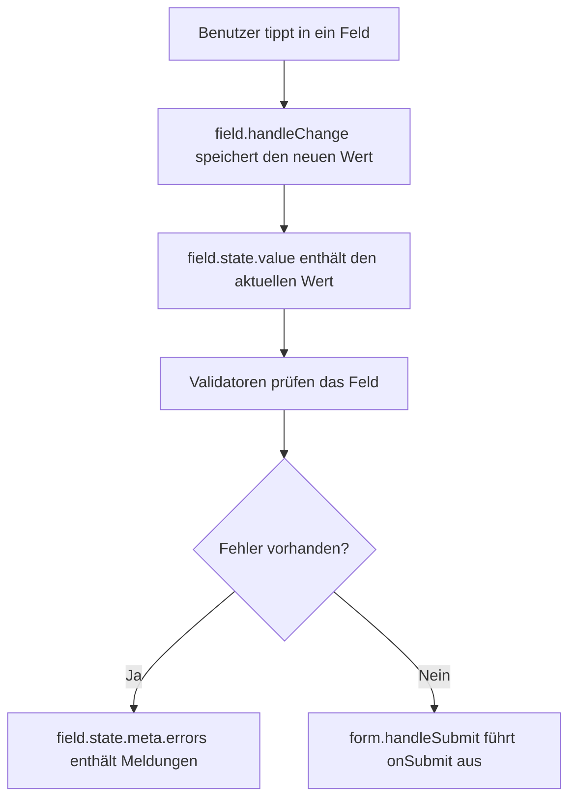

###### Themen

Formular-Handling mit TanStack Form

- Einrichtung und Grundprinzipien von TanStack Form
- Formulardaten mit `form.Field` erfassen
- Validierung und Fehlerausgabe mit TanStack Form

<br><br><br>

# 🧾 Formular-Handling mit TanStack Form

TanStack Form ist eine Bibliothek, mit der du Formulare in React strukturiert verwalten kannst. Sie hilft dir dabei, Eingabewerte, Validierung, Fehlermeldungen und Absenden an einer klaren Stelle zu organisieren. Das ist besonders nützlich, sobald ein Formular mehr als ein oder zwei Felder hat.

Ohne Formularbibliothek würdest du oft für jedes Feld eigenen State mit `useState` schreiben, eigene `onChange`-Funktionen bauen und Fehler selbst in einem separaten Objekt speichern. Das funktioniert, wird aber schnell unübersichtlich. TanStack Form nimmt dir diese Grundstruktur nicht komplett „magisch“ ab, sondern macht sie bewusst sichtbar: Jedes Formular hat eine Formularinstanz, jedes Feld hat einen eigenen Feldzustand, und Validierung wird dort definiert, wo sie gebraucht wird. ([TanStack Form - Quick Start](https://tanstack.com/form/latest/docs/framework/react/quick-start))

Ein wichtiger Gedanke für Anfänger ist: **TanStack Form ersetzt nicht dein HTML-Formular. Es hilft dir, den Zustand und die Regeln deines Formulars sauber zu verwalten.**

<br><br><br>

## ⚙️ Einrichtung und Grundprinzipien von TanStack Form

Die Grundlage in React ist der Hook `useForm()`. Er erstellt eine Formularinstanz. Diese Formularinstanz enthält Methoden und Komponenten, mit denen du Felder anlegst, Werte speicherst, Validierung ausführst und das Formular absendest. ([TanStack Form - Basic Concepts](https://tanstack.com/form/latest/docs/framework/react/guides/basic-concepts))

<br><br><br>

### 📦 Einrichtung in einem React-Projekt

Installiert wird die React-Version von TanStack Form mit dem Paketnamen `@tanstack/react-form`.

```bash
npm install @tanstack/react-form
```

Danach importierst du `useForm` in der Komponente, in der dein Formular liegt.

```jsx
import { useForm } from "@tanstack/react-form";

export default function Kontaktformular() {
  const form = useForm({
    defaultValues: {
      vorname: "",
    },
    onSubmit: ({ value }) => {
      console.log(value);
    },
  });

  return (
    <form
      onSubmit={(event) => {
        event.preventDefault();
        event.stopPropagation();
        form.handleSubmit();
      }}
    >
      <form.Field name="vorname">
        {(field) => (
          <label>
            Vorname
            <input
              value={field.state.value}
              onBlur={field.handleBlur}
              onChange={(event) => field.handleChange(event.target.value)}
            />
          </label>
        )}
      </form.Field>

      <button type="submit">Senden</button>
    </form>
  );
}
```

In diesem kleinen Beispiel passieren bereits die wichtigsten Dinge:

- `useForm(...)` erstellt das Formular.
- `defaultValues` legt die Startwerte fest.
- `onSubmit` beschreibt, was beim erfolgreichen Absenden passiert.
- `form.Field` verbindet ein einzelnes Feld mit TanStack Form.
- `field.state.value` enthält den aktuellen Wert des Feldes.
- `field.handleChange(...)` informiert TanStack Form über neue Eingaben.
- `form.handleSubmit()` startet das Absenden über TanStack Form.

Das sieht am Anfang nach etwas mehr Code aus als ein einzelnes normales `<input>`. Der Vorteil zeigt sich aber schnell, wenn mehrere Felder, Fehler und Regeln dazukommen.

<br><br><br>

### 🧠 Das Grundprinzip: Formularinstanz und Felder

Bei TanStack Form ist das Formular selbst ein Objekt. Dieses Objekt nennen wir hier die **Formularinstanz**. Du bekommst sie aus `useForm()`.

```jsx
const form = useForm({
  defaultValues: {
    email: "",
  },
  onSubmit: ({ value }) => {
    console.log(value);
  },
});
```

Diese Formularinstanz kennt die Startwerte, die aktuellen Werte, den Submit-Vorgang und den Formularstatus. Einzelne Eingabefelder werden dann über `form.Field` angelegt. Ein Field steht für ein konkretes Formularfeld, zum Beispiel `email`, `name` oder `nachricht`. ([TanStack Form - Basic Concepts](https://tanstack.com/form/latest/docs/framework/react/guides/basic-concepts))

```jsx
<form.Field name="email">
  {(field) => (
    <input
      value={field.state.value}
      onChange={(event) => field.handleChange(event.target.value)}
    />
  )}
</form.Field>
```

Das Feld bekommt über die Funktion `(field) => (...)` Zugriff auf seine eigenen Daten und Methoden. Dieses Muster nennt man **Render Prop**: TanStack Form gibt dir ein `field`-Objekt, und du entscheidest, welches JSX daraus gerendert wird.

<br><br><br>

### 📊 Klassische React-Formulare und TanStack Form im Vergleich

| Thema           | Klassisch mit `useState`                                | Mit TanStack Form                                               |
| --------------- | ------------------------------------------------------- | --------------------------------------------------------------- |
| Werte speichern | Oft eigener State pro Feld oder ein großes State-Objekt | Werte liegen in der Formularinstanz                             |
| Feldanbindung   | `value` und `onChange` selbst verwalten                 | `field.state.value` und `field.handleChange` nutzen             |
| Validierung     | Eigene Prüf-Funktionen schreiben und aufrufen           | Validatoren direkt am Feld oder am Formular definieren          |
| Fehlerausgabe   | Fehlerobjekt selbst pflegen                             | Fehler liegen im Feldstatus, z. B. in `field.state.meta.errors` |
| Formularstatus  | Manuell verwalten                                       | Über `form.Subscribe` gezielt auslesen                          |
| Typische Stärke | Sehr kleine Formulare                                   | Wachsende und komplexere Formulare                              |

TanStack Form ist besonders stark, wenn ein Formular wachsen kann: mehr Felder, mehrere Validierungszeitpunkte, asynchrone Prüfungen oder wiederverwendbare Formularbausteine. Für den Einstieg reicht aber erst einmal das einfache Muster mit `useForm` und `form.Field`.

<br><br><br>

### 🔄 Typischer Ablauf eines Formulars mit TanStack Form



Dieser Ablauf ist wichtig, weil TanStack Form Werte, Fehler und Submit-Zustand nicht versteckt. Du kannst jederzeit sehen, welches Feld welchen Wert hat und welche Fehler gerade vorhanden sind.

<br><br><br>

## 📝 Formulardaten mit `form.Field` erfassen

Ein Formularfeld wird in TanStack Form mit `form.Field` erstellt. Der wichtigste Prop ist `name`. Dieser Name muss zu einem Eintrag in `defaultValues` passen. Wenn du also ein Feld `email` verwenden möchtest, sollte `email` auch in `defaultValues` stehen.

```jsx
const form = useForm({
  defaultValues: {
    email: "",
  },
  onSubmit: ({ value }) => {
    console.log(value.email);
  },
});
```

```jsx
<form.Field name="email">
  {(field) => (
    <input
      value={field.state.value}
      onBlur={field.handleBlur}
      onChange={(event) => field.handleChange(event.target.value)}
    />
  )}
</form.Field>
```

Beim Absenden landet der Wert dann unter `value.email`. Der Feldname bestimmt also die Struktur deiner Formulardaten.

<br><br><br>

### 🧾 Einfaches Beispiel mit mehreren Feldern

```jsx
import { useForm } from "@tanstack/react-form";

export default function Profilformular() {
  const form = useForm({
    defaultValues: {
      vorname: "",
      nachname: "",
      email: "",
    },
    onSubmit: ({ value }) => {
      console.log("Gesendete Daten:", value);
    },
  });

  return (
    <form
      onSubmit={(event) => {
        event.preventDefault();
        event.stopPropagation();
        form.handleSubmit();
      }}
    >
      <form.Field name="vorname">
        {(field) => (
          <label>
            Vorname
            <input
              value={field.state.value}
              onBlur={field.handleBlur}
              onChange={(event) => field.handleChange(event.target.value)}
            />
          </label>
        )}
      </form.Field>

      <form.Field name="nachname">
        {(field) => (
          <label>
            Nachname
            <input
              value={field.state.value}
              onBlur={field.handleBlur}
              onChange={(event) => field.handleChange(event.target.value)}
            />
          </label>
        )}
      </form.Field>

      <form.Field name="email">
        {(field) => (
          <label>
            E-Mail
            <input
              type="email"
              value={field.state.value}
              onBlur={field.handleBlur}
              onChange={(event) => field.handleChange(event.target.value)}
            />
          </label>
        )}
      </form.Field>

      <button type="submit">Speichern</button>
    </form>
  );
}
```

Beim erfolgreichen Absenden entsteht ein Objekt mit genau den Feldern aus `defaultValues`:

```json
{
  "vorname": "Lena",
  "nachname": "Müller",
  "email": "lena@example.com"
}
```

Das ist für Anfänger ein gutes mentales Modell: **`defaultValues` beschreibt die Form deiner Daten. `form.Field` verbindet ein sichtbares Eingabefeld mit einem dieser Werte.**

<br><br><br>

### 🔌 Was das `field`-Objekt enthält

Das `field`-Objekt ist dein Zugang zu einem einzelnen Formularfeld. Besonders wichtig sind am Anfang diese Teile:

| Teil                       | Bedeutung                     |
| -------------------------- | ----------------------------- |
| `field.name`               | Name des Feldes               |
| `field.state.value`        | aktueller Wert                |
| `field.handleChange(...)`  | Wert ändern                   |
| `field.handleBlur`         | Feld als verlassen markieren  |
| `field.state.meta.errors`  | Fehlermeldungen des Feldes    |
| `field.state.meta.isValid` | ob das Feld gerade gültig ist |

Ein normales Textfeld sieht deshalb meistens so aus:

```jsx
<input
  id={field.name}
  name={field.name}
  value={field.state.value}
  onBlur={field.handleBlur}
  onChange={(event) => field.handleChange(event.target.value)}
/>
```

Wichtig: TanStack Form weiß nicht automatisch, was in deinem Input passiert. Du musst bei Änderungen `field.handleChange(...)` aufrufen. Dadurch wird der neue Wert in der Formularinstanz gespeichert.

<br><br><br>

### 🧰 Typische Feldarten

Textfelder, Textareas, Selects und Checkboxen funktionieren alle nach demselben Grundprinzip: Der aktuelle Wert kommt aus `field.state.value`, Änderungen gehen über `field.handleChange(...)` zurück an TanStack Form.

```jsx
<form.Field name="biografie">
  {(field) => (
    <label>
      Biografie
      <textarea
        value={field.state.value}
        onBlur={field.handleBlur}
        onChange={(event) => field.handleChange(event.target.value)}
      />
    </label>
  )}
</form.Field>
```

```jsx
<form.Field name="rolle">
  {(field) => (
    <label>
      Rolle
      <select
        value={field.state.value}
        onBlur={field.handleBlur}
        onChange={(event) => field.handleChange(event.target.value)}
      >
        <option value="">Bitte wählen</option>
        <option value="student">Student</option>
        <option value="developer">Developer</option>
        <option value="designer">Designer</option>
      </select>
    </label>
  )}
</form.Field>
```

Bei Checkboxen ist nicht `event.target.value` wichtig, sondern `event.target.checked`.

```jsx
<form.Field name="newsletter">
  {(field) => (
    <label>
      <input
        type="checkbox"
        checked={field.state.value}
        onBlur={field.handleBlur}
        onChange={(event) => field.handleChange(event.target.checked)}
      />
      Newsletter abonnieren
    </label>
  )}
</form.Field>
```

Dazu muss der Startwert in `defaultValues` ein Boolean sein:

```jsx
defaultValues: {
  newsletter: false,
}
```

<br><br><br>

### 🎯 `defaultValues` richtig verstehen

`defaultValues` sind die Anfangswerte deines Formulars. Gleichzeitig beschreiben sie, welche Felder dein Formular kennt.

```jsx
const form = useForm({
  defaultValues: {
    name: "",
    email: "",
    newsletter: false,
    rolle: "",
  },
  onSubmit: ({ value }) => {
    console.log(value);
  },
});
```

Diese Startwerte sind wichtig, weil deine Inputs dadurch von Anfang an kontrollierte Werte bekommen. Ein Textfeld startet mit `""`, eine Checkbox mit `false`, eine Zahl zum Beispiel mit `0`. Das verhindert viele typische Anfängerprobleme mit `undefined`-Werten.

Bei Bearbeiten-Formularen kannst du vorhandene Daten als Startwerte einsetzen. Dann ist das Formular direkt mit den aktuellen Daten gefüllt.

<br><br><br>

## ✅ Validierung und Fehlerausgabe mit TanStack Form

Validierung bedeutet: Du prüfst, ob die eingegebenen Daten vollständig und sinnvoll sind. TanStack Form kann Validierung auf Feldebene und auf Formularebene durchführen. Für den Einstieg ist Validierung direkt am Feld am einfachsten. ([TanStack Form - Validation](https://tanstack.com/form/latest/docs/framework/react/guides/validation))

Ein Feld bekommt dafür einen `validators`-Prop. Darin kannst du festlegen, wann geprüft wird, zum Beispiel:

- `onChange`: beim Ändern des Feldes
- `onBlur`: wenn das Feld verlassen wird
- `onSubmit`: beim Absenden
- `onChangeAsync` oder `onSubmitAsync`: für asynchrone Prüfungen

Wenn eine Validierungsfunktion einen String zurückgibt, gilt dieser String als Fehlermeldung. Wenn alles gültig ist, gibst du `undefined` zurück.

<br><br><br>

### 📏 Häufige Validierungsregeln

| Regel         | Bedeutung                          | Beispiel-Idee                                             |
| ------------- | ---------------------------------- | --------------------------------------------------------- |
| Pflichtfeld   | Wert darf nicht leer sein          | `!value.trim() ? "Bitte Namen eingeben." : undefined`     |
| Mindestlänge  | Wert braucht genug Zeichen         | `value.length < 3 ? "Mindestens 3 Zeichen." : undefined`  |
| Maximallänge  | Wert darf nicht zu lang sein       | `value.length > 200 ? "Maximal 200 Zeichen." : undefined` |
| E-Mail-Format | Wert muss wie eine E-Mail aussehen | Regex mit `/^[^\s@]+@[^\s@]+\.[^\s@]+$/`                  |
| Eigene Regel  | Fachliche Prüfung                  | z. B. Benutzername darf nicht `admin` sein                |

Für Anfänger ist wichtig: Eine Validierungsfunktion ist einfach eine normale Funktion. Sie bekommt den aktuellen Wert und entscheidet, ob es eine Fehlermeldung gibt.

<br><br><br>

### 🚨 Einfaches Beispiel für Validierung und Fehlermeldungen

```jsx
import { useForm } from "@tanstack/react-form";

export default function Registrierungsformular() {
  const form = useForm({
    defaultValues: {
      benutzername: "",
      email: "",
    },
    onSubmit: ({ value }) => {
      console.log("Registrierung:", value);
    },
  });

  return (
    <form
      onSubmit={(event) => {
        event.preventDefault();
        event.stopPropagation();
        form.handleSubmit();
      }}
      noValidate
    >
      <form.Field
        name="benutzername"
        validators={{
          onBlur: ({ value }) => {
            if (!value.trim()) {
              return "Bitte gib einen Benutzernamen ein.";
            }

            if (value.trim().length < 3) {
              return "Der Benutzername muss mindestens 3 Zeichen lang sein.";
            }

            return undefined;
          },
        }}
      >
        {(field) => (
          <div>
            <label htmlFor={field.name}>Benutzername</label>
            <input
              id={field.name}
              value={field.state.value}
              onBlur={field.handleBlur}
              onChange={(event) => field.handleChange(event.target.value)}
              aria-invalid={!field.state.meta.isValid}
            />
            {!field.state.meta.isValid && (
              <p role="alert">{field.state.meta.errors.join(", ")}</p>
            )}
          </div>
        )}
      </form.Field>

      <form.Field
        name="email"
        validators={{
          onBlur: ({ value }) => {
            if (!value.trim()) {
              return "Bitte gib deine E-Mail-Adresse ein.";
            }

            if (!/^[^\s@]+@[^\s@]+\.[^\s@]+$/.test(value)) {
              return "Bitte gib eine gültige E-Mail-Adresse ein.";
            }

            return undefined;
          },
        }}
      >
        {(field) => (
          <div>
            <label htmlFor={field.name}>E-Mail</label>
            <input
              id={field.name}
              type="email"
              value={field.state.value}
              onBlur={field.handleBlur}
              onChange={(event) => field.handleChange(event.target.value)}
              aria-invalid={!field.state.meta.isValid}
            />
            {!field.state.meta.isValid && (
              <p role="alert">{field.state.meta.errors.join(", ")}</p>
            )}
          </div>
        )}
      </form.Field>

      <button type="submit">Registrieren</button>
    </form>
  );
}
```

In diesem Beispiel wird bei `onBlur` validiert. Das bedeutet: Die Fehlermeldung erscheint, wenn der Benutzer ein Feld verlässt. Das ist für viele Formulare angenehmer als eine Prüfung bei jedem Tastendruck.

<br><br><br>

### 🗂️ Wie Fehler in TanStack Form aussehen

Jedes Feld hat eigene Metadaten unter `field.state.meta`. Dort findest du unter anderem:

```jsx
field.state.meta.errors;
field.state.meta.isValid;
field.state.meta.isTouched;
field.state.meta.isBlurred;
```

`errors` ist ein Array. Darum wird es oft mit `.join(", ")` oder `.map(...)` angezeigt.

```jsx
{
  field.state.meta.errors.map((error) => (
    <p key={error} role="alert">
      {error}
    </p>
  ));
}
```

Wenn du nur eine einfache Fehlermeldung pro Feld zurückgibst, reicht häufig auch:

```jsx
{
  !field.state.meta.isValid && (
    <p role="alert">{field.state.meta.errors.join(", ")}</p>
  );
}
```

Der Vorteil dieser Struktur ist: Der Fehler gehört direkt zum Feld. Du musst kein eigenes globales `errors`-Objekt bauen, um am Anfang saubere Fehlermeldungen anzuzeigen.

<br><br><br>

### 👀 Wann validiert TanStack Form?

TanStack Form lässt dich bewusst entscheiden, wann geprüft wird. Das ist ein zentraler Unterschied zu vielen einfachen Formularlösungen. ([TanStack Form - Validation](https://tanstack.com/form/latest/docs/framework/react/guides/validation))

| Validator       | Zeitpunkt                    | Gut geeignet für                    |
| --------------- | ---------------------------- | ----------------------------------- |
| `onChange`      | bei jeder Änderung           | kurze Live-Prüfungen                |
| `onBlur`        | wenn das Feld verlassen wird | anfängerfreundliche Fehlermeldungen |
| `onSubmit`      | beim Absenden                | finale Prüfung                      |
| `onChangeAsync` | asynchron beim Ändern        | z. B. Verfügbarkeit prüfen          |
| `onSubmitAsync` | asynchron beim Absenden      | z. B. Serverprüfung                 |

Für den Einstieg ist `onBlur` oft ein guter Mittelweg. Der Benutzer bekommt Rückmeldung, aber nicht sofort beim ersten Buchstaben.

```jsx
validators={{
  onBlur: ({ value }) =>
    value.trim() ? undefined : "Bitte fülle dieses Feld aus.",
}}
```

<br><br><br>

### 🧪 Eigene Validierungslogik schreiben

Da Validatoren normale Funktionen sind, kannst du deine Regeln gut lesbar formulieren.

```jsx
validators={{
  onBlur: ({ value }) => {
    const cleanValue = value.trim();

    if (!cleanValue) {
      return "Bitte gib einen Namen ein.";
    }

    if (cleanValue.toLowerCase() === "admin") {
      return "Der Name admin ist nicht erlaubt.";
    }

    return undefined;
  },
}}
```

Das Muster ist immer gleich:

1. Wert prüfen.
2. Bei Fehler einen Text zurückgeben.
3. Wenn alles passt, `undefined` zurückgeben.

Diese Klarheit macht TanStack Form gut geeignet für Lernende: Du siehst direkt, welche Regel zu welchem Feld gehört.

<br><br><br>

### 🖥️ Submit-Button mit Formularstatus verbinden

TanStack Form kann dir auch sagen, ob das Formular gerade abgesendet wird oder ob es abgesendet werden kann. Dafür nutzt du `form.Subscribe`. Damit abonnierst du gezielt einen Teil des Formularstatus. ([TanStack Form - Basic Concepts](https://tanstack.com/form/latest/docs/framework/react/guides/basic-concepts))

```jsx
<form.Subscribe selector={(state) => [state.canSubmit, state.isSubmitting]}>
  {([canSubmit, isSubmitting]) => (
    <button type="submit" disabled={!canSubmit}>
      {isSubmitting ? "Wird gesendet..." : "Absenden"}
    </button>
  )}
</form.Subscribe>
```

Das ist besser, als den gesamten Formularstatus überall zu lesen. Die Komponente rendert dann nur neu, wenn sich genau diese ausgewählten Werte ändern.

Wichtig für die Benutzerfreundlichkeit: Ein deaktivierter Button allein erklärt noch nicht, was falsch ist. Zeige zusätzlich immer verständliche Fehlermeldungen direkt an den betroffenen Feldern.

<br><br><br>

### ♿ Barrierearme Fehlerdarstellung

Gute Formulare sind nicht nur optisch verständlich, sondern auch semantisch sauber. Dazu gehören:

- ein echtes `<label>` für jedes Feld
- `htmlFor` und `id`, damit Label und Feld verbunden sind
- `aria-invalid`, wenn ein Feld ungültig ist
- `role="alert"` oder `aria-describedby` für Fehlermeldungen

```jsx
<label htmlFor={field.name}>E-Mail</label>
<input
  id={field.name}
  type="email"
  value={field.state.value}
  onBlur={field.handleBlur}
  onChange={(event) => field.handleChange(event.target.value)}
  aria-invalid={!field.state.meta.isValid}
  aria-describedby={
    field.state.meta.errors.length > 0 ? `${field.name}-error` : undefined
  }
/>
{field.state.meta.errors.length > 0 && (
  <p id={`${field.name}-error`} role="alert">
    {field.state.meta.errors.join(", ")}
  </p>
)}
```

Auch wenn TanStack Form die Formularlogik verwaltet, bleibt gute Formular-UI deine Aufgabe. Klare Labels, verständliche Texte und sichtbare Fehler sind für Benutzer genauso wichtig wie korrekter Code.

<br><br><br>

### 🧼 Typische Denkfehler beim Einstieg

Ein häufiger Fehler ist, `field.handleChange` zu vergessen. Dann sieht das Input-Feld vielleicht aus wie ein normales Feld, aber TanStack Form bekommt die Änderung nicht mit.

```jsx
// Problematisch: TanStack Form erfährt nichts vom neuen Wert.
<input value={field.state.value} />
```

Richtig ist:

```jsx
<input
  value={field.state.value}
  onChange={(event) => field.handleChange(event.target.value)}
/>
```

Ein zweiter häufiger Fehler ist ein fehlender Eintrag in `defaultValues`. Wenn du ein Feld `telefon` renderst, sollte auch `telefon` in `defaultValues` stehen.

```jsx
defaultValues: {
  telefon: "",
}
```

Ein dritter häufiger Fehler betrifft Checkboxen. Dort musst du mit `checked` arbeiten, nicht mit `value`.

```jsx
<input
  type="checkbox"
  checked={field.state.value}
  onChange={(event) => field.handleChange(event.target.checked)}
/>
```

<br><br><br>

### 🧩 Vollständiges Beispiel: Datenerfassung plus Validierung

```jsx
import { useForm } from "@tanstack/react-form";

export default function Kontaktformular() {
  const form = useForm({
    defaultValues: {
      name: "",
      email: "",
      nachricht: "",
      newsletter: false,
    },
    onSubmit: ({ value }) => {
      console.log("Gesendete Daten:", value);
    },
  });

  return (
    <form
      onSubmit={(event) => {
        event.preventDefault();
        event.stopPropagation();
        form.handleSubmit();
      }}
      noValidate
    >
      <form.Field
        name="name"
        validators={{
          onBlur: ({ value }) => {
            if (!value.trim()) {
              return "Bitte gib deinen Namen ein.";
            }

            if (value.trim().length < 2) {
              return "Der Name muss mindestens 2 Zeichen lang sein.";
            }

            return undefined;
          },
        }}
      >
        {(field) => (
          <div>
            <label htmlFor={field.name}>Name</label>
            <input
              id={field.name}
              value={field.state.value}
              onBlur={field.handleBlur}
              onChange={(event) => field.handleChange(event.target.value)}
              aria-invalid={!field.state.meta.isValid}
            />
            {!field.state.meta.isValid && (
              <p role="alert">{field.state.meta.errors.join(", ")}</p>
            )}
          </div>
        )}
      </form.Field>

      <form.Field
        name="email"
        validators={{
          onBlur: ({ value }) => {
            if (!value.trim()) {
              return "Bitte gib deine E-Mail-Adresse ein.";
            }

            if (!/^[^\s@]+@[^\s@]+\.[^\s@]+$/.test(value)) {
              return "Bitte gib eine gültige E-Mail-Adresse ein.";
            }

            return undefined;
          },
        }}
      >
        {(field) => (
          <div>
            <label htmlFor={field.name}>E-Mail</label>
            <input
              id={field.name}
              type="email"
              value={field.state.value}
              onBlur={field.handleBlur}
              onChange={(event) => field.handleChange(event.target.value)}
              aria-invalid={!field.state.meta.isValid}
            />
            {!field.state.meta.isValid && (
              <p role="alert">{field.state.meta.errors.join(", ")}</p>
            )}
          </div>
        )}
      </form.Field>

      <form.Field
        name="nachricht"
        validators={{
          onBlur: ({ value }) => {
            if (!value.trim()) {
              return "Bitte schreibe eine Nachricht.";
            }

            if (value.trim().length < 10) {
              return "Die Nachricht muss mindestens 10 Zeichen lang sein.";
            }

            if (value.length > 200) {
              return "Die Nachricht darf maximal 200 Zeichen lang sein.";
            }

            return undefined;
          },
        }}
      >
        {(field) => (
          <div>
            <label htmlFor={field.name}>Nachricht</label>
            <textarea
              id={field.name}
              value={field.state.value}
              onBlur={field.handleBlur}
              onChange={(event) => field.handleChange(event.target.value)}
              aria-invalid={!field.state.meta.isValid}
            />
            {!field.state.meta.isValid && (
              <p role="alert">{field.state.meta.errors.join(", ")}</p>
            )}
          </div>
        )}
      </form.Field>

      <form.Field name="newsletter">
        {(field) => (
          <label>
            <input
              type="checkbox"
              checked={field.state.value}
              onBlur={field.handleBlur}
              onChange={(event) => field.handleChange(event.target.checked)}
            />
            Newsletter abonnieren
          </label>
        )}
      </form.Field>

      <form.Subscribe
        selector={(state) => [state.canSubmit, state.isSubmitting]}
      >
        {([canSubmit, isSubmitting]) => (
          <button type="submit" disabled={!canSubmit}>
            {isSubmitting ? "Wird gesendet..." : "Nachricht senden"}
          </button>
        )}
      </form.Subscribe>
    </form>
  );
}
```

Dieses Beispiel verbindet die wichtigsten Grundideen:

- Die Formularstruktur steht in `defaultValues`.
- Jedes Feld wird mit `form.Field` verbunden.
- Werte werden über `field.state.value` gelesen.
- Änderungen werden mit `field.handleChange(...)` gespeichert.
- Validierung wird im jeweiligen Feld über `validators` definiert.
- Fehlermeldungen kommen aus `field.state.meta.errors`.
- Der Submit-Button liest den Formularstatus über `form.Subscribe`.

Damit hast du ein solides Grundmuster für Formulare mit TanStack Form in React. Später kannst du darauf aufbauen: mit Schema-Bibliotheken wie Zod, asynchroner Validierung, wiederverwendbaren Field-Komponenten oder mehrstufigen Formularen.
