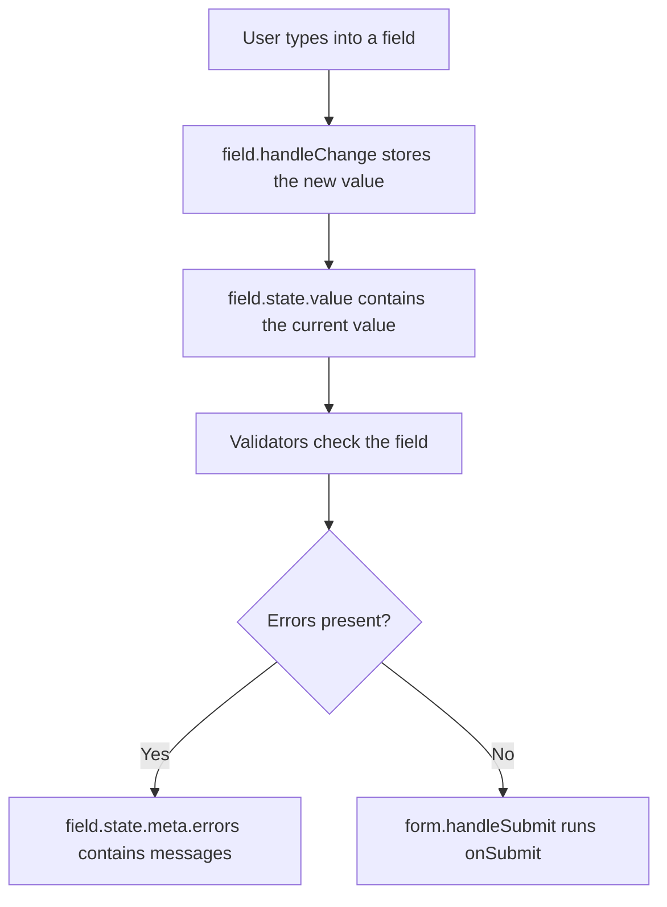

###### Topics

Form handling with TanStack Form

- Setting up and core principles of TanStack Form
- Capturing form data with `form.Field`
- Validation and displaying errors with TanStack Form

<br><br><br>

# 🧾 Form Handling with TanStack Form

TanStack Form is a library that helps you manage forms in React in a structured way. It helps you organize input values, validation, error messages, and submission logic in one clear place. This becomes especially useful as soon as a form has more than one or two fields.

Without a form library, you would often write separate state with `useState` for each field, build your own `onChange` functions, and store errors in a separate object yourself. That works, but it can become hard to read quickly. TanStack Form does not hide the basic structure from you completely. Instead, it makes it explicit: every form has a form instance, every field has its own field state, and validation is defined where it is needed. ([TanStack Form - Quick Start](https://tanstack.com/form/latest/docs/framework/react/quick-start))

An important idea for beginners is: **TanStack Form does not replace your HTML form. It helps you manage the state and rules of your form cleanly.**

<br><br><br>

## ⚙️ Setting Up and Core Principles of TanStack Form

In React, the foundation is the `useForm()` hook. It creates a form instance. This form instance contains methods and components that you use to create fields, store values, run validation, and submit the form. ([TanStack Form - Basic Concepts](https://tanstack.com/form/latest/docs/framework/react/guides/basic-concepts))

<br><br><br>

### 📦 Setup in a React Project

The React version of TanStack Form is installed with the package name `@tanstack/react-form`.

```bash
npm install @tanstack/react-form
```

Then you import `useForm` in the component where your form lives.

```jsx
import { useForm } from "@tanstack/react-form";

export default function ContactForm() {
  const form = useForm({
    defaultValues: {
      firstName: "",
    },
    onSubmit: ({ value }) => {
      console.log(value);
    },
  });

  return (
    <form
      onSubmit={(event) => {
        event.preventDefault();
        event.stopPropagation();
        form.handleSubmit();
      }}
    >
      <form.Field name="firstName">
        {(field) => (
          <label>
            First Name
            <input
              value={field.state.value}
              onBlur={field.handleBlur}
              onChange={(event) => field.handleChange(event.target.value)}
            />
          </label>
        )}
      </form.Field>

      <button type="submit">Send</button>
    </form>
  );
}
```

A lot of important things already happen in this small example:

- `useForm(...)` creates the form.
- `defaultValues` defines the initial values.
- `onSubmit` describes what happens after a successful submit.
- `form.Field` connects a single field to TanStack Form.
- `field.state.value` contains the current value of the field.
- `field.handleChange(...)` informs TanStack Form about new input.
- `form.handleSubmit()` starts the submission through TanStack Form.

At the beginning, this may look like a little more code than a single normal `<input>`. But the benefit becomes visible quickly when more fields, errors, and rules are added.

<br><br><br>

### 🧠 The Core Principle: Form Instance and Fields

In TanStack Form, the form itself is an object. Here, we call this object the **form instance**. You get it from `useForm()`.

```jsx
const form = useForm({
  defaultValues: {
    email: "",
  },
  onSubmit: ({ value }) => {
    console.log(value);
  },
});
```

This form instance knows the initial values, the current values, the submit process, and the form state. Individual input fields are then created with `form.Field`. A Field represents one concrete form field, for example `email`, `name`, or `message`. ([TanStack Form - Basic Concepts](https://tanstack.com/form/latest/docs/framework/react/guides/basic-concepts))

```jsx
<form.Field name="email">
  {(field) => (
    <input
      value={field.state.value}
      onChange={(event) => field.handleChange(event.target.value)}
    />
  )}
</form.Field>
```

The field gets access to its own data and methods through the function `(field) => (...)`. This pattern is called a **render prop**: TanStack Form gives you a `field` object, and you decide which JSX should be rendered from it.

<br><br><br>

### 📊 Classic React Forms and TanStack Form Compared

| Topic | Classic with `useState` | With TanStack Form |
|---|---|---|
| Storing values | Often separate state per field or one large state object | Values live in the form instance |
| Field binding | Manage `value` and `onChange` yourself | Use `field.state.value` and `field.handleChange` |
| Validation | Write and call custom validation functions | Define validators directly on the field or form |
| Error output | Maintain an error object yourself | Errors live in the field state, e.g. in `field.state.meta.errors` |
| Form status | Manage manually | Read selectively through `form.Subscribe` |
| Typical strength | Very small forms | Growing and more complex forms |

TanStack Form is especially strong when a form can grow: more fields, multiple validation times, asynchronous checks, or reusable form building blocks. For the beginning, however, the simple pattern with `useForm` and `form.Field` is enough.

<br><br><br>

### 🔄 Typical Flow of a Form with TanStack Form



This flow is important because TanStack Form does not hide values, errors, and submit state. You can always see which field has which value and which errors are currently present.

<br><br><br>

## 📝 Capturing Form Data with `form.Field`

A form field is created in TanStack Form with `form.Field`. The most important prop is `name`. This name must match an entry in `defaultValues`. So if you want to use a field called `email`, `email` should also exist in `defaultValues`.

```jsx
const form = useForm({
  defaultValues: {
    email: "",
  },
  onSubmit: ({ value }) => {
    console.log(value.email);
  },
});
```

```jsx
<form.Field name="email">
  {(field) => (
    <input
      value={field.state.value}
      onBlur={field.handleBlur}
      onChange={(event) => field.handleChange(event.target.value)}
    />
  )}
</form.Field>
```

When the form is submitted, the value is then available under `value.email`. The field name therefore determines the structure of your form data.

<br><br><br>

### 🧾 Simple Example with Multiple Fields

```jsx
import { useForm } from "@tanstack/react-form";

export default function ProfileForm() {
  const form = useForm({
    defaultValues: {
      firstName: "",
      lastName: "",
      email: "",
    },
    onSubmit: ({ value }) => {
      console.log("Submitted data:", value);
    },
  });

  return (
    <form
      onSubmit={(event) => {
        event.preventDefault();
        event.stopPropagation();
        form.handleSubmit();
      }}
    >
      <form.Field name="firstName">
        {(field) => (
          <label>
            First Name
            <input
              value={field.state.value}
              onBlur={field.handleBlur}
              onChange={(event) => field.handleChange(event.target.value)}
            />
          </label>
        )}
      </form.Field>

      <form.Field name="lastName">
        {(field) => (
          <label>
            Last Name
            <input
              value={field.state.value}
              onBlur={field.handleBlur}
              onChange={(event) => field.handleChange(event.target.value)}
            />
          </label>
        )}
      </form.Field>

      <form.Field name="email">
        {(field) => (
          <label>
            Email
            <input
              type="email"
              value={field.state.value}
              onBlur={field.handleBlur}
              onChange={(event) => field.handleChange(event.target.value)}
            />
          </label>
        )}
      </form.Field>

      <button type="submit">Save</button>
    </form>
  );
}
```

After a successful submit, an object is created with exactly the fields from `defaultValues`:

```json
{
  "firstName": "Lena",
  "lastName": "Miller",
  "email": "lena@example.com"
}
```

This is a helpful mental model for beginners: **`defaultValues` describes the shape of your data. `form.Field` connects a visible input field to one of these values.**

<br><br><br>

### 🔌 What the `field` Object Contains

The `field` object is your access point to a single form field. At the beginning, these parts are especially important:

| Part | Meaning |
|---|---|
| `field.name` | name of the field |
| `field.state.value` | current value |
| `field.handleChange(...)` | change the value |
| `field.handleBlur` | mark the field as blurred |
| `field.state.meta.errors` | error messages of the field |
| `field.state.meta.isValid` | whether the field is currently valid |

A normal text field therefore usually looks like this:

```jsx
<input
  id={field.name}
  name={field.name}
  value={field.state.value}
  onBlur={field.handleBlur}
  onChange={(event) => field.handleChange(event.target.value)}
/>
```

Important: TanStack Form does not automatically know what happens in your input. You must call `field.handleChange(...)` when the value changes. This stores the new value in the form instance.

<br><br><br>

### 🧰 Typical Field Types

Text fields, textareas, selects, and checkboxes all work with the same basic principle: the current value comes from `field.state.value`, and changes go back to TanStack Form through `field.handleChange(...)`.

```jsx
<form.Field name="biography">
  {(field) => (
    <label>
      Biography
      <textarea
        value={field.state.value}
        onBlur={field.handleBlur}
        onChange={(event) => field.handleChange(event.target.value)}
      />
    </label>
  )}
</form.Field>
```

```jsx
<form.Field name="role">
  {(field) => (
    <label>
      Role
      <select
        value={field.state.value}
        onBlur={field.handleBlur}
        onChange={(event) => field.handleChange(event.target.value)}
      >
        <option value="">Please select</option>
        <option value="student">Student</option>
        <option value="developer">Developer</option>
        <option value="designer">Designer</option>
      </select>
    </label>
  )}
</form.Field>
```

For checkboxes, `event.target.value` is not the important part. You need `event.target.checked`.

```jsx
<form.Field name="newsletter">
  {(field) => (
    <label>
      <input
        type="checkbox"
        checked={field.state.value}
        onBlur={field.handleBlur}
        onChange={(event) => field.handleChange(event.target.checked)}
      />
      Subscribe to newsletter
    </label>
  )}
</form.Field>
```

For this, the initial value in `defaultValues` must be a boolean:

```jsx
defaultValues: {
  newsletter: false,
}
```

<br><br><br>

### 🎯 Understanding `defaultValues` Properly

`defaultValues` are the initial values of your form. At the same time, they describe which fields your form knows.

```jsx
const form = useForm({
  defaultValues: {
    name: "",
    email: "",
    newsletter: false,
    role: "",
  },
  onSubmit: ({ value }) => {
    console.log(value);
  },
});
```

These initial values are important because your inputs receive controlled values from the beginning. A text field starts with `""`, a checkbox with `false`, and a number for example with `0`. This prevents many typical beginner issues with `undefined` values.

For edit forms, you can use existing data as initial values. Then the form is filled with the current data immediately.

<br><br><br>

## ✅ Validation and Displaying Errors with TanStack Form

Validation means checking whether the entered data is complete and meaningful. TanStack Form can run validation at the field level and at the form level. For the beginning, validation directly on the field is the easiest approach. ([TanStack Form - Validation](https://tanstack.com/form/latest/docs/framework/react/guides/validation))

A field receives a `validators` prop for this. Inside it, you can define when validation should happen, for example:

- `onChange`: when the field changes
- `onBlur`: when the field is left
- `onSubmit`: when the form is submitted
- `onChangeAsync` or `onSubmitAsync`: for asynchronous checks

If a validation function returns a string, that string is treated as the error message. If everything is valid, you return `undefined`.

<br><br><br>

### 📏 Common Validation Rules

| Rule | Meaning | Example idea |
|---|---|---|
| Required field | Value must not be empty | `!value.trim() ? "Please enter a name." : undefined` |
| Minimum length | Value needs enough characters | `value.length < 3 ? "At least 3 characters." : undefined` |
| Maximum length | Value must not be too long | `value.length > 200 ? "Maximum 200 characters." : undefined` |
| E-mail format | Value must look like an e-mail | regex with `/^[^\s@]+@[^\s@]+\.[^\s@]+$/` |
| Custom rule | Domain-specific check | e.g. username must not be `admin` |

For beginners, the important part is: a validation function is just a normal function. It receives the current value and decides whether there is an error message.

<br><br><br>

### 🚨 Simple Example for Validation and Error Messages

```jsx
import { useForm } from "@tanstack/react-form";

export default function RegistrationForm() {
  const form = useForm({
    defaultValues: {
      username: "",
      email: "",
    },
    onSubmit: ({ value }) => {
      console.log("Registration:", value);
    },
  });

  return (
    <form
      onSubmit={(event) => {
        event.preventDefault();
        event.stopPropagation();
        form.handleSubmit();
      }}
      noValidate
    >
      <form.Field
        name="username"
        validators={{
          onBlur: ({ value }) => {
            if (!value.trim()) {
              return "Please enter a username.";
            }

            if (value.trim().length < 3) {
              return "The username must be at least 3 characters long.";
            }

            return undefined;
          },
        }}
      >
        {(field) => (
          <div>
            <label htmlFor={field.name}>Username</label>
            <input
              id={field.name}
              value={field.state.value}
              onBlur={field.handleBlur}
              onChange={(event) => field.handleChange(event.target.value)}
              aria-invalid={!field.state.meta.isValid}
            />
            {!field.state.meta.isValid && (
              <p role="alert">{field.state.meta.errors.join(", ")}</p>
            )}
          </div>
        )}
      </form.Field>

      <form.Field
        name="email"
        validators={{
          onBlur: ({ value }) => {
            if (!value.trim()) {
              return "Please enter your e-mail address.";
            }

            if (!/^[^\s@]+@[^\s@]+\.[^\s@]+$/.test(value)) {
              return "Please enter a valid e-mail address.";
            }

            return undefined;
          },
        }}
      >
        {(field) => (
          <div>
            <label htmlFor={field.name}>Email</label>
            <input
              id={field.name}
              type="email"
              value={field.state.value}
              onBlur={field.handleBlur}
              onChange={(event) => field.handleChange(event.target.value)}
              aria-invalid={!field.state.meta.isValid}
            />
            {!field.state.meta.isValid && (
              <p role="alert">{field.state.meta.errors.join(", ")}</p>
            )}
          </div>
        )}
      </form.Field>

      <button type="submit">Register</button>
    </form>
  );
}
```

In this example, validation runs on `onBlur`. That means the error message appears when the user leaves a field. For many forms, this feels more pleasant than checking on every keystroke.

<br><br><br>

### 🗂️ What Errors Look Like in TanStack Form

Every field has its own metadata under `field.state.meta`. There you can find, among other things:

```jsx
field.state.meta.errors;
field.state.meta.isValid;
field.state.meta.isTouched;
field.state.meta.isBlurred;
```

`errors` is an array. That is why it is often displayed with `.join(", ")` or `.map(...)`.

```jsx
{field.state.meta.errors.map((error) => (
  <p key={error} role="alert">
    {error}
  </p>
))}
```

If you return only one simple error message per field, this is often enough:

```jsx
{!field.state.meta.isValid && (
  <p role="alert">{field.state.meta.errors.join(", ")}</p>
)}
```

The advantage of this structure is: the error belongs directly to the field. You do not need to build your own global `errors` object just to show clean error messages at the beginning.

<br><br><br>

### 👀 When Does TanStack Form Validate?

TanStack Form lets you decide deliberately when validation should run. This is a central difference from many simple form solutions. ([TanStack Form - Validation](https://tanstack.com/form/latest/docs/framework/react/guides/validation))

| Validator | Time | Well suited for |
|---|---|---|
| `onChange` | on every change | short live checks |
| `onBlur` | when the field is left | beginner-friendly error messages |
| `onSubmit` | on submit | final checks |
| `onChangeAsync` | asynchronously on change | e.g. checking availability |
| `onSubmitAsync` | asynchronously on submit | e.g. server validation |

For the beginning, `onBlur` is often a good middle ground. The user gets feedback, but not immediately after the first letter.

```jsx
validators={{
  onBlur: ({ value }) =>
    value.trim() ? undefined : "Please fill out this field.",
}}
```

<br><br><br>

### 🧪 Writing Custom Validation Logic

Because validators are normal functions, you can write your rules in a very readable way.

```jsx
validators={{
  onBlur: ({ value }) => {
    const cleanValue = value.trim();

    if (!cleanValue) {
      return "Please enter a name.";
    }

    if (cleanValue.toLowerCase() === "admin") {
      return "The name admin is not allowed.";
    }

    return undefined;
  },
}}
```

The pattern is always the same:

1. Check the value.
2. Return a text if there is an error.
3. Return `undefined` if everything is fine.

This clarity makes TanStack Form well suited for learners: you can see directly which rule belongs to which field.

<br><br><br>

### 🖥️ Connecting the Submit Button to Form State

TanStack Form can also tell you whether the form is currently being submitted or whether it can be submitted. For this, you use `form.Subscribe`. With it, you subscribe to a specific part of the form state. ([TanStack Form - Basic Concepts](https://tanstack.com/form/latest/docs/framework/react/guides/basic-concepts))

```jsx
<form.Subscribe selector={(state) => [state.canSubmit, state.isSubmitting]}>
  {([canSubmit, isSubmitting]) => (
    <button type="submit" disabled={!canSubmit}>
      {isSubmitting ? "Submitting..." : "Submit"}
    </button>
  )}
</form.Subscribe>
```

This is better than reading the entire form state everywhere. The component then only re-renders when exactly these selected values change.

Important for user-friendliness: a disabled button alone does not explain what is wrong. Always also show understandable error messages directly next to the affected fields.

<br><br><br>

### ♿ Accessible Error Presentation

Good forms are not only visually understandable, but also semantically clean. This includes:

- a real `<label>` for every field
- `htmlFor` and `id`, so the label and field are connected
- `aria-invalid` when a field is invalid
- `role="alert"` or `aria-describedby` for error messages

```jsx
<label htmlFor={field.name}>Email</label>
<input
  id={field.name}
  type="email"
  value={field.state.value}
  onBlur={field.handleBlur}
  onChange={(event) => field.handleChange(event.target.value)}
  aria-invalid={!field.state.meta.isValid}
  aria-describedby={
    field.state.meta.errors.length > 0 ? `${field.name}-error` : undefined
  }
/>
{field.state.meta.errors.length > 0 && (
  <p id={`${field.name}-error`} role="alert">
    {field.state.meta.errors.join(", ")}
  </p>
)}
```

Even though TanStack Form manages the form logic, good form UI remains your responsibility. Clear labels, understandable text, and visible errors are just as important for users as correct code.

<br><br><br>

### 🧼 Typical Beginner Mistakes

A common mistake is forgetting `field.handleChange`. Then the input may look like a normal field, but TanStack Form does not receive the change.

```jsx
// Problematic: TanStack Form does not learn about the new value.
<input value={field.state.value} />
```

Correct:

```jsx
<input
  value={field.state.value}
  onChange={(event) => field.handleChange(event.target.value)}
/>
```

A second common mistake is a missing entry in `defaultValues`. If you render a field called `phone`, `phone` should also exist in `defaultValues`.

```jsx
defaultValues: {
  phone: "",
}
```

A third common mistake concerns checkboxes. There, you must work with `checked`, not with `value`.

```jsx
<input
  type="checkbox"
  checked={field.state.value}
  onChange={(event) => field.handleChange(event.target.checked)}
/>
```

<br><br><br>

### 🧩 Complete Example: Data Collection plus Validation

```jsx
import { useForm } from "@tanstack/react-form";

export default function ContactForm() {
  const form = useForm({
    defaultValues: {
      name: "",
      email: "",
      message: "",
      newsletter: false,
    },
    onSubmit: ({ value }) => {
      console.log("Submitted data:", value);
    },
  });

  return (
    <form
      onSubmit={(event) => {
        event.preventDefault();
        event.stopPropagation();
        form.handleSubmit();
      }}
      noValidate
    >
      <form.Field
        name="name"
        validators={{
          onBlur: ({ value }) => {
            if (!value.trim()) {
              return "Please enter your name.";
            }

            if (value.trim().length < 2) {
              return "The name must be at least 2 characters long.";
            }

            return undefined;
          },
        }}
      >
        {(field) => (
          <div>
            <label htmlFor={field.name}>Name</label>
            <input
              id={field.name}
              value={field.state.value}
              onBlur={field.handleBlur}
              onChange={(event) => field.handleChange(event.target.value)}
              aria-invalid={!field.state.meta.isValid}
            />
            {!field.state.meta.isValid && (
              <p role="alert">{field.state.meta.errors.join(", ")}</p>
            )}
          </div>
        )}
      </form.Field>

      <form.Field
        name="email"
        validators={{
          onBlur: ({ value }) => {
            if (!value.trim()) {
              return "Please enter your e-mail address.";
            }

            if (!/^[^\s@]+@[^\s@]+\.[^\s@]+$/.test(value)) {
              return "Please enter a valid e-mail address.";
            }

            return undefined;
          },
        }}
      >
        {(field) => (
          <div>
            <label htmlFor={field.name}>Email</label>
            <input
              id={field.name}
              type="email"
              value={field.state.value}
              onBlur={field.handleBlur}
              onChange={(event) => field.handleChange(event.target.value)}
              aria-invalid={!field.state.meta.isValid}
            />
            {!field.state.meta.isValid && (
              <p role="alert">{field.state.meta.errors.join(", ")}</p>
            )}
          </div>
        )}
      </form.Field>

      <form.Field
        name="message"
        validators={{
          onBlur: ({ value }) => {
            if (!value.trim()) {
              return "Please write a message.";
            }

            if (value.trim().length < 10) {
              return "The message must be at least 10 characters long.";
            }

            if (value.length > 200) {
              return "The message may be at most 200 characters long.";
            }

            return undefined;
          },
        }}
      >
        {(field) => (
          <div>
            <label htmlFor={field.name}>Message</label>
            <textarea
              id={field.name}
              value={field.state.value}
              onBlur={field.handleBlur}
              onChange={(event) => field.handleChange(event.target.value)}
              aria-invalid={!field.state.meta.isValid}
            />
            {!field.state.meta.isValid && (
              <p role="alert">{field.state.meta.errors.join(", ")}</p>
            )}
          </div>
        )}
      </form.Field>

      <form.Field name="newsletter">
        {(field) => (
          <label>
            <input
              type="checkbox"
              checked={field.state.value}
              onBlur={field.handleBlur}
              onChange={(event) => field.handleChange(event.target.checked)}
            />
            Subscribe to newsletter
          </label>
        )}
      </form.Field>

      <form.Subscribe
        selector={(state) => [state.canSubmit, state.isSubmitting]}
      >
        {([canSubmit, isSubmitting]) => (
          <button type="submit" disabled={!canSubmit}>
            {isSubmitting ? "Submitting..." : "Send Message"}
          </button>
        )}
      </form.Subscribe>
    </form>
  );
}
```

This example combines the most important basic ideas:

- The form structure is defined in `defaultValues`.
- Every field is connected with `form.Field`.
- Values are read through `field.state.value`.
- Changes are saved with `field.handleChange(...)`.
- Validation is defined on each field through `validators`.
- Error messages come from `field.state.meta.errors`.
- The submit button reads the form state through `form.Subscribe`.

With this, you have a solid basic pattern for forms with TanStack Form in React. Later, you can build on it with schema libraries like Zod, asynchronous validation, reusable field components, or multi-step forms.
